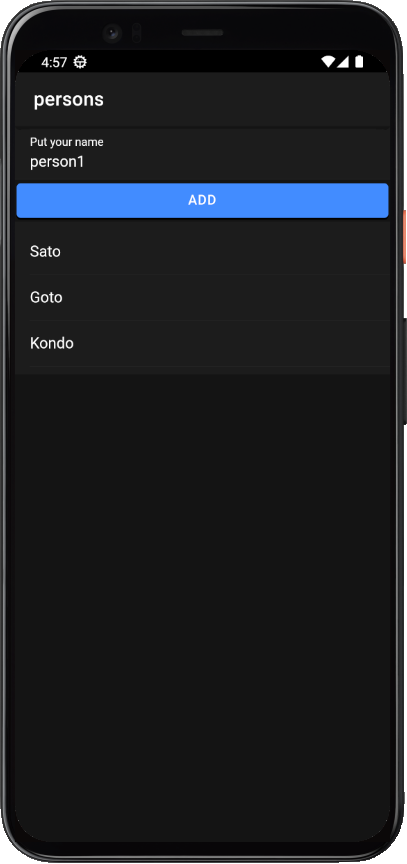
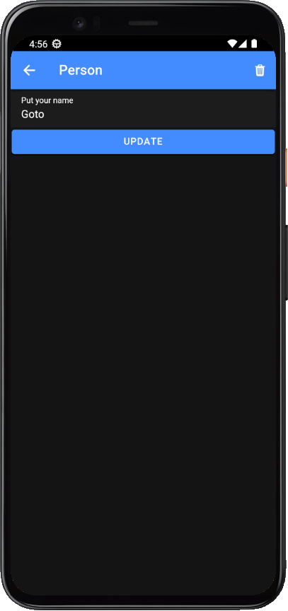

# Ionic/Angular/SQLite with cordova simple Application.

## modules

* [ionic/angular Version 7](https://ionicframework.com/)
* [Angular version 16](https://angular.io/)
* [Ionic version 7](https://ionicframework.com/docs/cli)
* [cordova plugin SQLite database version 6.4](https://ionicframework.com/docs/native/sqlite)
* [cordova SQLite Porter version 6.4](https://ionicframework.com/docs/native/sqlite-porter)

## UI/Screens

## Functions
* Create a new table within the process
* person add/update/delete

## License

* This project is licensed under the terms of the MIT license.
